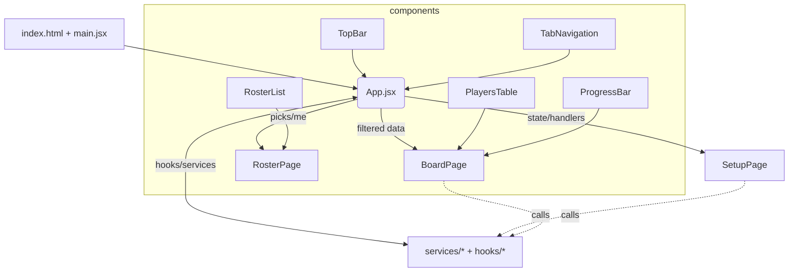

# Architecture Overview

- **App.jsx** orchestrates global state and effects.
- **Pages** are presentational; they receive state + handlers via props.
- **Services** encapsulate network/storage/CSV logic.
- **Components** are stateless UI building blocks.
